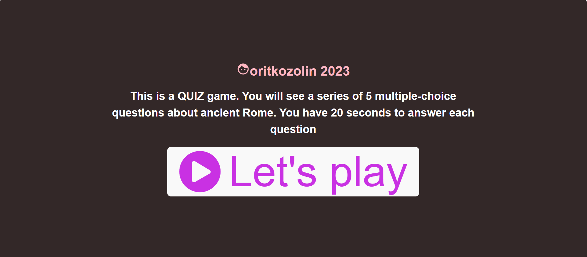
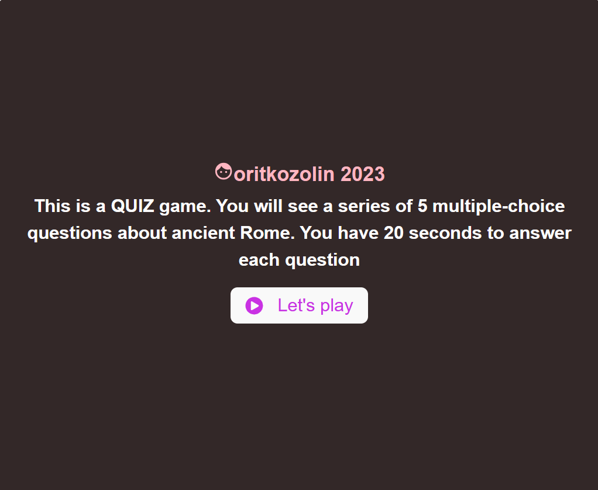
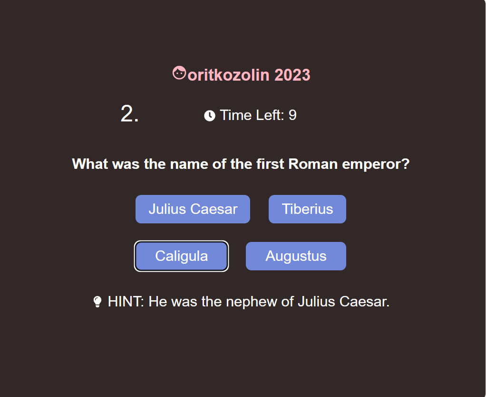
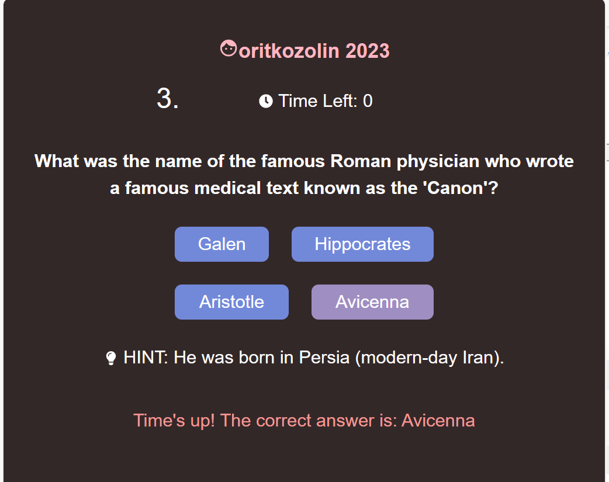
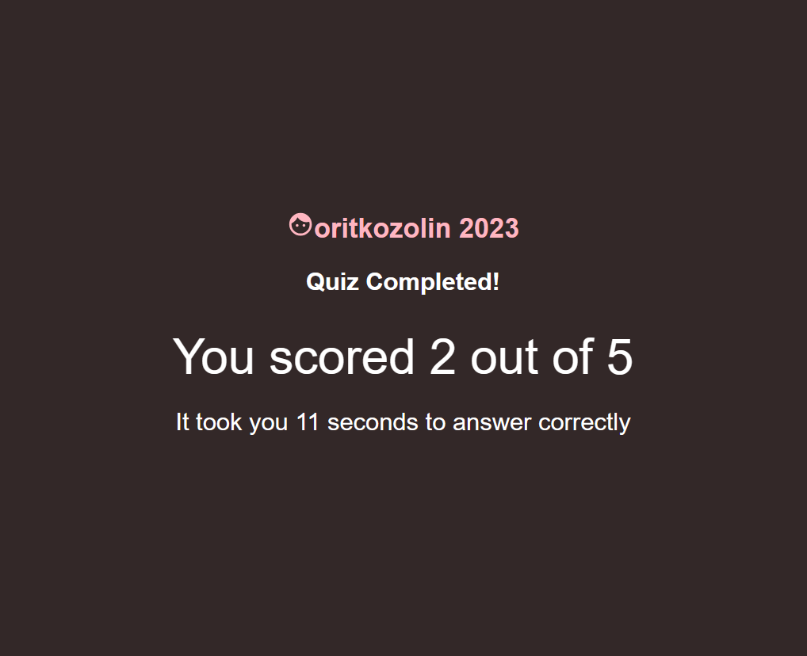

# Ancient Rome Quiz application
The purpose of the application is for users to test their knowledge about Ancient Rome.

### Game instructions
1. Press the 'start' button to begin the game
2. Choose the answer you desire, 
3. After that the game will proceed automatically to the next question
4. Note, that upon timeout after the correct answer is presented, you cannot choose any answer :-)
5. When game is finished, you will see your score and time it took for you to answer correctly
6. To play again simply refresh your page

#### Start page on wide screen


1. [Tech Stack](#stack)
2. [Getting Started](#run)
3. [Learn more](#Vite)

This project was bootstrapped with [Vite](#Vite)

## <a id="stack"></a> Tech Stack:
1. ##### Frontend: React, Styled Components, Redux toolkit

   * The user interface should include a "Start Quiz" button that triggers the quiz.
   * Once the quiz is started, the user should see a series of 5 multiple-choice questions about ancient Rome, fetched from the backend, or generated random in mocks, each with an accompanying hint.
   * Each question should have a 20-second countdown timer. After 10 seconds the hint will present. After the time for the question ended, the application should automatically show the correct answer for 1 second and proceed to the next question.
   * Each question will have 2-4 answers, the size of the app should not change, the answers size should be aligned to the number of answers in the question.
   * Upon completion of the quiz or expiry of the time for all questions, the application should display the user's score (X of Y questions answer correctly or 1 point for any correct answer).
   * The user interface should be responsive and user-friendly.
   * save and display the sum of the time it took the user to answer his correct answers. 
   * Responsive Design - compatibility across different browsers.

#### Start page on smaller screen (responsive design)

#### Question with hint

#### Question with correct answer displayed

#### Quiz summary


2. ##### Backend: Express NodeJs

   * It should provide a RESTful API that serves a random set of 5 quiz questions upon request.
   * The backend should not collect or store any user-specific data.


## <a id="run"></a> Getting Started
1. Clone or download (from this page). 
   * To clone, write at you local machine command line

   ### `git clone https://github.com/okozolin/rome-quiz.`git`

2. After the project is copied,in the project directory, you can run: 
   * install all the dependencies
   ### `npm install`
3. Run server
   ### `npm run node_dev`
4. Run the client
   ### `npm run dev`


## <a id="Vite"></a> Learn More

### React + TypeScript + Vite 

This template provides a minimal setup to get React working in Vite with HMR and some ESLint rules.

Currently, two official plugins are available:

- [@vitejs/plugin-react](https://github.com/vitejs/vite-plugin-react/blob/main/packages/plugin-react/README.md) uses [Babel](https://babeljs.io/) for Fast Refresh
- [@vitejs/plugin-react-swc](https://github.com/vitejs/vite-plugin-react-swc) uses [SWC](https://swc.rs/) for Fast Refresh

### Expanding the ESLint configuration

If you are developing a production application, we recommend updating the configuration to enable type aware lint rules:

- Configure the top-level `parserOptions` property like this:

```js
export default {
  // other rules...
  parserOptions: {
    ecmaVersion: 'latest',
    sourceType: 'module',
    project: ['./tsconfig.json', './tsconfig.node.json'],
    tsconfigRootDir: __dirname,
  },
}
```

- Replace `plugin:@typescript-eslint/recommended` to `plugin:@typescript-eslint/recommended-type-checked` or `plugin:@typescript-eslint/strict-type-checked`
- Optionally add `plugin:@typescript-eslint/stylistic-type-checked`
- Install [eslint-plugin-react](https://github.com/jsx-eslint/eslint-plugin-react) and add `plugin:react/recommended` & `plugin:react/jsx-runtime` to the `extends` list
